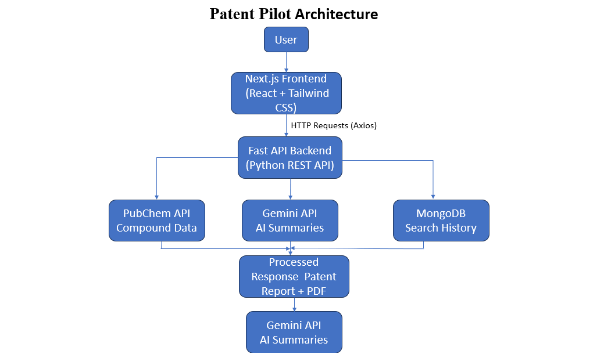
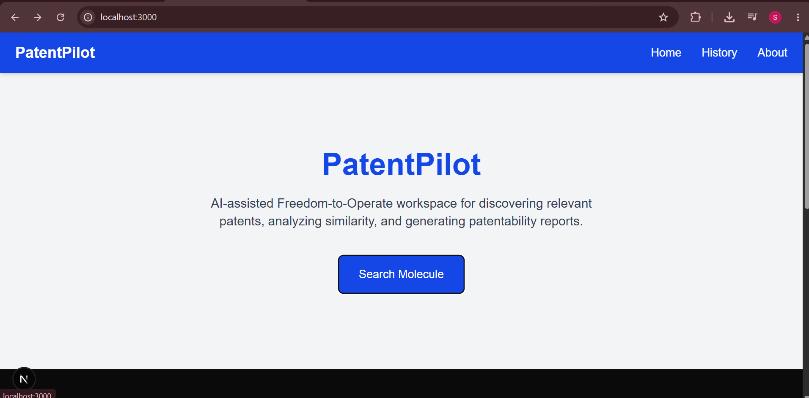
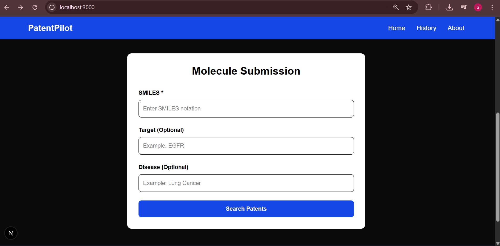
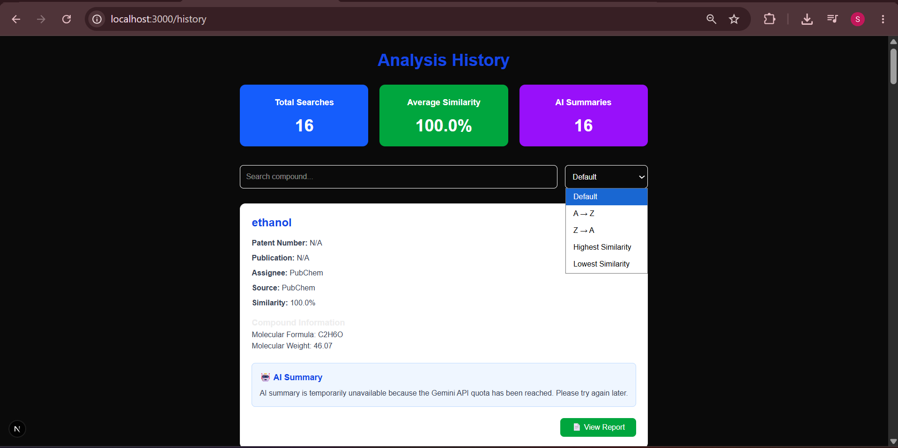
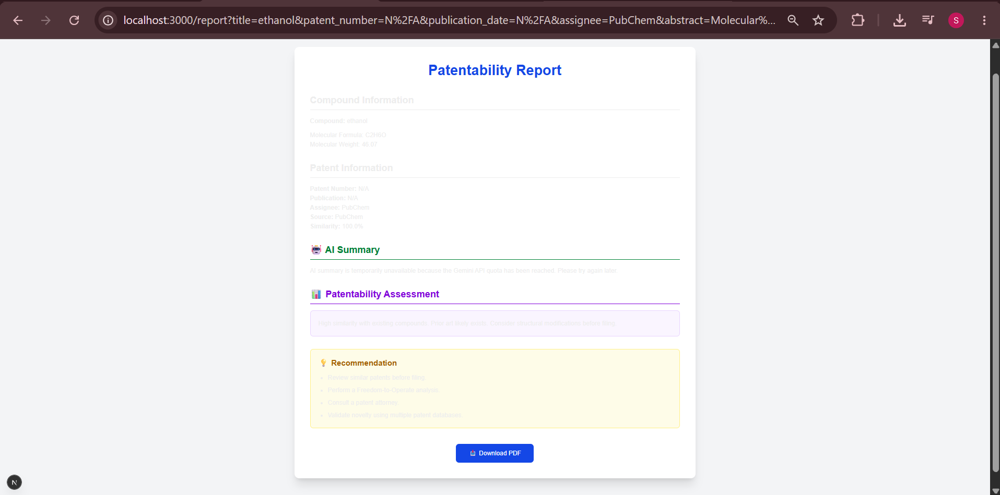
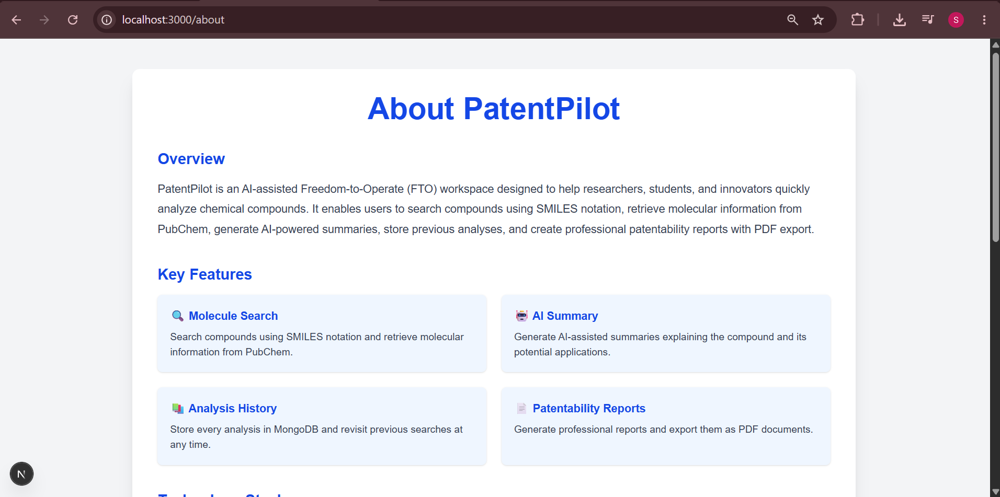
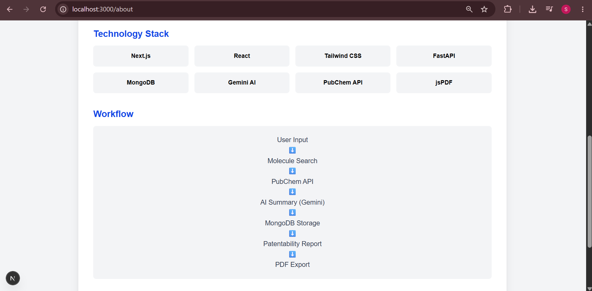

# 🚀 PatentPilot

An AI-assisted Freedom-to-Operate (FTO) workspace that helps researchers perform an initial patentability assessment by analyzing molecules, retrieving compound information, generating AI-assisted summaries, maintaining analysis history, and creating professional patentability reports.

Developed as part of the **Centella AI Therapeutics – AI Product Engineering Internship Assessment**.

---

# 📌 Project Overview

PatentPilot enables researchers to perform an initial analysis of a molecule before investing time in optimization or synthesis.

The application allows users to:

- Submit a molecule using SMILES notation
- Retrieve compound information from PubChem
- Generate an AI-assisted analysis using Google Gemini
- Store previous analyses in MongoDB
- Search and review previous analyses
- Generate a structured patentability report
- Export reports as PDF

> **Note:** This project is intended as an AI-assisted research workspace and does not replace professional patent review.

---

# ✨ Features

- 🔍 Molecule search using SMILES notation
- 🧪 PubChem integration
- 🤖 AI-assisted compound analysis using Gemini
- 📚 MongoDB history storage
- 🔎 Search and filter analysis history
- 📊 Dashboard for previous analyses
- 📄 Professional patentability report
- 📥 Export report as PDF
- 📱 Responsive UI

---

# 🏗️ Architecture



### System Flow

```
User
   │
   ▼
Next.js Frontend
   │
HTTP (Axios)
   │
   ▼
FastAPI Backend
   │
 ├────────► PubChem API
 │
 ├────────► Gemini API
 │
 └────────► MongoDB
   │
   ▼
Patent Report
```

---

# 🔍 Retrieval Strategy

PatentPilot uses **PubChem** as the primary public molecular information source.

Workflow:

1. User submits a molecule using SMILES notation.
2. FastAPI queries the PubChem REST API.
3. Molecular properties such as:
   - IUPAC Name
   - Molecular Formula
   - Molecular Weight
4. The retrieved information is structured into a patent review card.
5. The analysis is stored in MongoDB for future review.

PubChem was selected because it provides reliable and publicly accessible molecular information that can be directly queried using SMILES notation.

---

# 🤖 AI Workflow

The retrieved compound information is sent to Google Gemini.

Gemini generates an AI-assisted explanation describing:

- Compound overview
- Molecular interpretation
- Chemical significance
- Research insights

If the Gemini API quota is exceeded, PatentPilot gracefully displays a fallback message instead of failing.

---

# 🛠️ Technologies Used

## Frontend

- Next.js
- React
- TypeScript
- Tailwind CSS
- Axios

## Backend

- FastAPI
- Python

## Database

- MongoDB

## APIs

- PubChem REST API
- Google Gemini API

## Libraries

- PyMongo
- html2pdf.js
- Uvicorn

---

# 📂 Project Structure

```
PatentPilot
│
├── app
├── backend
├── components
├── public
├── screenshots
├── architecture.png
├── README.md
└── package.json
```

---

# ⚖️ Assumptions

- PubChem provides sufficient molecular information for an initial AI-assisted review.
- The generated AI summary is intended to assist researchers and should not be considered legal or patent advice.
- PatentPilot performs an initial screening rather than a complete Freedom-to-Operate analysis.

---

# 🔄 Trade-offs

Current implementation focuses on:

- Fast response time
- Publicly available APIs
- Lightweight architecture

Instead of commercial patent databases, PubChem was selected to simplify implementation while demonstrating the complete AI workflow.

---

# 🚀 Future Improvements

- Integration with SureChEMBL
- Google Patents integration
- Semantic patent search
- Molecular similarity search
- Authentication
- Cloud deployment
- Advanced AI risk scoring
- Interactive molecular visualization
- Export reports in Word format

---

# ⚙️ Setup Instructions

## 1. Clone the repository

```bash
git clone https://github.com/siriharshithagit/PatentPilot.git
```

---

## 2. Navigate to the project

```bash
cd PatentPilot
```

---

## 3. Frontend Setup

Install dependencies:

```bash
npm install
```

Run the frontend:

```bash
npm run dev
```

Frontend URL:

```
http://localhost:3000
```

---

## 4. Backend Setup

Navigate to backend:

```bash
cd backend
```

Create a virtual environment:

```bash
python -m venv venv
```

Activate it:

### Windows

```bash
venv\Scripts\activate
```

Install dependencies:

```bash
pip install -r requirements.txt
```

Run the backend:

```bash
uvicorn app.main:app --reload
```

Backend URL:

```
http://127.0.0.1:8000
```

---

## 5. MongoDB

Ensure MongoDB is running locally.

Default connection:

```
mongodb://localhost:27017
```

Database:

```
patentpilot
```

Collection:

```
analyses
```

---

# 📷 Screenshots

## 🏠 Home

### Hero Section



### Molecule Submission



---

## 📚 Analysis History



---

## 📄 Patentability Report



---

## ℹ️ About

### About Page (Top)



### About Page (Bottom)



---

# 👩‍💻 Author

**Siri Harshitha Reddy**

B.Tech – Computer Science and Engineering

VNR Vignana Jyothi Institute of Engineering and Technology

---

# 📄 License

This project was developed for educational purposes as part of the **Centella AI Therapeutics AI Product Engineering Internship Assessment**.